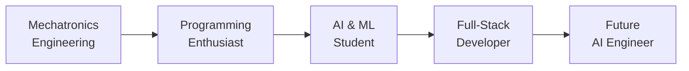

<div align="center">

# 👨‍💻 Ajay Kumar T A

### AI & Machine Learning Engineer | Full-Stack Developer | Innovation Enthusiast

[](https://www.linkedin.com/in/ajay12942/)
[](https://github.com/ajay12942)
[](#)


</div>

---

## 🚀 About Me

```python
class AjayKumar:
    def __init__(self):
        self.work = "Research Engineer@siemens"
        self.location = "Bangalore, India 🇮🇳"
        self.work = "Research Engineer@siemens"
        self.education = "RNSIT - AI & Machine Learning"
        self.background = "Mechatronics Engineering"
        self.passion = ["AI/ML", "Full-Stack Development", "Problem Solving"]
        self.current_focus = "Building intelligent applications that bridge technology and real-world impact"
    
    def say_hi(self):
        print("Thanks for dropping by! Let's build something amazing together!")

ajay = AjayKumar()
ajay.say_hi()
```

> 💡 Transitioning from electro-mechanical engineering to AI/ML, I bring a unique perspective that combines hardware understanding with software innovation. Currently diving deep into machine learning algorithms, neural networks, and building scalable web applications.

---

## 🛠️ Tech Stack

<div align="center">

### 💻 Languages & Frameworks


### 🎨 Frontend Technologies


### ⚙️ Backend & Frameworks


### 🗄️ Databases


### 🔧 Tools & DevOps


</div>

---

## 🎯 Featured Projects

<div align="center">

| Project | Description | Tech Stack | Links |
|---------|-------------|------------|-------|
| **🏦 HCL Banking Backend** | Hackathon-winning banking solution with robust backend architecture | Python, Django, PostgreSQL | [View →](https://github.com/ajay12942/HCL_banking_backend) |
| **🤖 Edu Bot** | AI-powered educational assistant for personalized learning | Python, NLP, Machine Learning | [View →](https://github.com/ajay12942/Edu_bot) |
| **🏀 NBA Analytics** | Advanced data analysis and visualization of NBA statistics | JavaScript, React, Data Viz | [View →](https://github.com/ajay12942/NBA) |
| **💡 LiFi Technology** | Exploring Light Fidelity for next-gen wireless communication | Hardware + Software | [View →](https://github.com/ajay12942/LIFI) |

</div>

---

## 📊 GitHub Analytics


<div align="center">
  
</div>

<div align="center">
  
</div>

---

## 🏆 Achievements

<div align="center">


</div>
---

## 📈 Contribution Graph

<div align="center">
  
</div>

---

## 💼 Professional Journey



---

## 🎓 Current Focus

- 🧠 Deep diving into **Neural Networks** and **Deep Learning**
- 🌐 Building production-ready **Full-Stack Applications**
- 📊 Exploring **Data Science** and **Machine Learning** algorithms
- 🤝 Contributing to **Open Source** projects
- 📚 Continuous learning and skill development

---

## 📫 Let's Connect!

<div align="center">

**"The best way to predict the future is to create it."**

I'm always excited to collaborate on innovative projects, discuss new technologies, or just chat about AI and development. Feel free to reach out!

[](https://www.linkedin.com/in/ajay12942/)
[](mailto:ajay12942@gmail.com)
[](https://github.com/ajay12942)

</div>

---

<div align="center">
  
### 💭 Random Dev Quote


### 🐍 Contribution Snake


---


**⭐️ From [ajay12942](https://github.com/ajay12942) with 💙**

</div>
